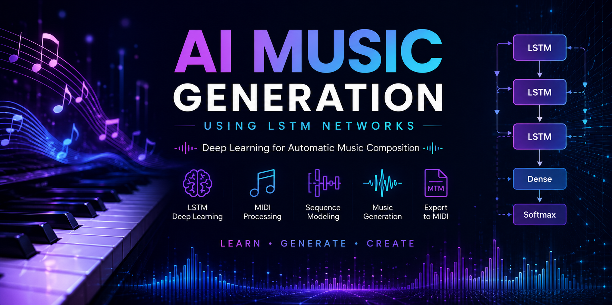
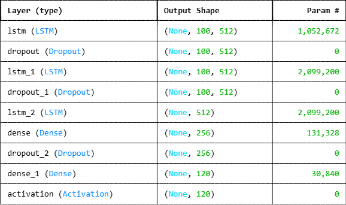
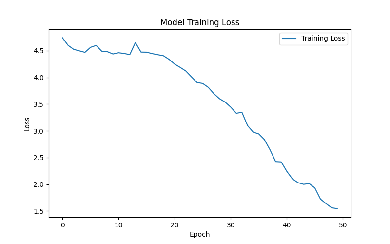

# 🎼 AI Music Generation using LSTM Networks

<p align="center">
  
</p>

<div align="center">

# Deep Learning for Music Composition

### LSTM • MIDI Processing • Sequence Modeling • Generative AI


</div>

---

# 🌟 Project Highlights

✅ Music Generation using Deep Learning

✅ MIDI Data Processing

✅ Sequence Prediction

✅ Multi-Layer LSTM Architecture

✅ Generative AI

✅ TensorFlow / Keras

✅ End-to-End Music Creation Pipeline

---

# 📖 Overview

This project explores the application of Long Short-Term Memory (LSTM) neural networks for automatic music generation.

By learning patterns from MIDI files, the model captures temporal relationships between musical notes and generates entirely new melodies.

The generated output can be exported as MIDI and played using any standard music software.

---

# 🎯 Objective

Given a sequence of musical notes:

```text
C4 → E4 → G4 → A4
```

Predict:

```text
Next Musical Note
```

Repeated predictions allow the model to generate complete musical compositions.

---

# 🧠 Model Architecture

The architecture consists of three stacked LSTM layers designed to learn long-term dependencies within musical sequences.

```text
Input Sequence
      │
      ▼
LSTM (512)
      │
      ▼
Dropout
      │
      ▼
LSTM (512)
      │
      ▼
Dropout
      │
      ▼
LSTM (512)
      │
      ▼
Dense (256)
      │
      ▼
Dropout
      │
      ▼
Softmax Output
      │
      ▼
Predicted Note
```

---

## Architecture Visualization

<p align="center">
  
</p>

---

# 📈 Training Performance

<p align="center">
  
</p>

The training loss decreases steadily, indicating successful learning of musical patterns and note transitions.

---

# 🎵 Music Generation Pipeline

1. Load MIDI files
2. Extract notes and chords
3. Create note sequences
4. Train LSTM network
5. Predict future notes
6. Generate new music
7. Export generated melody as MIDI

---

# 🛠 Technologies Used

| Category | Technology |
|----------|------------|
| Language | Python |
| Deep Learning | TensorFlow, Keras |
| Music Processing | music21 |
| Visualization | Matplotlib |
| Environment | Jupyter Notebook |

---

# 🚀 Future Improvements

- Bidirectional LSTM
- Attention Mechanism
- Transformer-based Music Generation
- Multi-Instrument Composition
- Real-Time Music Generation
- Web Deployment

---

# 👨‍💻 Author

### Moein Alva

Machine Learning & Deep Learning Enthusiast

Areas of Interest:

- Deep Learning
- Generative AI
- Computer Vision
- Recommendation Systems
- Algorithmic Trading

---

# 📄 License

MIT License

---

<div align="center">

⭐ If you enjoyed this project, consider giving it a star.

🎼 Built with Deep Learning and a passion for music.

</div>
